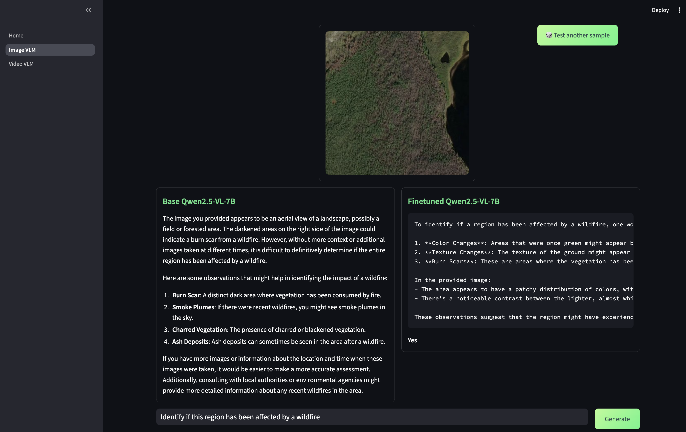

# Image VLM Fine-tuning with Qwen2.5-VL

This project demonstrates fine-tuning Vision-Language Models (VLMs) for image understanding tasks, specifically using the Qwen2.5-VL-7B model for wildfire detection from satellite imagery using GRPO (Generalized Reward Preference Optimization).

## Overview

The project includes:
- **Interactive Training Interface**: Streamlit-based UI for configuring and monitoring VLM fine-tuning
- **GRPO Training**: Advanced preference optimization for better reasoning capabilities
- **Multiple Fine-tuning Methods**: Support for LoRA, QLoRA, and Full Finetuning
- **Side-by-side Inference**: Compare base model vs fine-tuned model performance

## Getting Started

> **Note**: These instructions assume you are already inside the Docker container. For container setup, refer to the main project README at `vlm-finetuning/`.

### 1. Set Up Weights & Biases

Configure your wandb credentials for training monitoring:

```bash
export WANDB_PROJECT="vlm_finetuning"
export WANDB_ENTITY=<WANDB_USERNAME>
export WANDB_API_KEY=<WANDB_API_KEY>
```

### 2. Launch the Application

```bash
# Start the Streamlit interface
streamlit run Image_VLM.py
```

The application will be available at `http://localhost:8501`

## Training

### Dataset

The project uses a **wildfire detection dataset** with satellite imagery for training the model to identify wildfire-affected regions. The dataset includes:
- Satellite and aerial imagery from wildfire-affected areas
- Binary classification: wildfire vs no wildfire

#### Dataset Setup

1. **Download from Kaggle**: Visit the [Wildfire Prediction Dataset](https://www.kaggle.com/datasets/abdelghaniaaba/wildfire-prediction-dataset) on Kaggle

2. **Get the curl command**: On the Kaggle dataset page, click the download button and copy the curl command provided

3. **Download and extract**: Run the following commands in your container:

```bash
mkdir data
cd data

# Paste the curl command from Kaggle here, and then continue to unzip the dataset

unzip -qq wildfire-prediction-dataset.zip
rm wildfire-prediction-dataset.zip
cd ..
```

> **Note**: You'll need to be logged into Kaggle and may need to accept the dataset terms before the download link works.

### Training Configuration

Configure training through the interactive interface:

#### Model Settings
- **Base Model**: Qwen/Qwen2.5-VL-7B-Instruct
- **Fine-tuning Method**: Choose from LoRA, QLoRA, or Full Finetuning
- **LoRA Parameters**: Adjustable rank (8-64) and alpha (8-64)

#### Training Parameters
- **Epochs**: 1-100 (default: 10)
- **Batch Size**: 1, 2, 4, 8, or 16 (default: 2)
- **Learning Rate**: 1e-6 to 1e-2 (default: 1e-5)
- **Optimizer**: AdamW or Adafactor

#### GRPO Settings
- **Format Reward**: 2.0 (reward for proper reasoning format)
- **Correctness Reward**: 5.0 (reward for correct answers)
- **Number of Generations**: 4 (for preference optimization)

### Training Process

1. **Configure Parameters**: Use the web interface to set training hyperparameters
2. **Start Training**: Click "▶️ Start Finetuning" to begin GRPO training
3. **Monitor Progress**: View real-time loss curves and GPU utilization via embedded wandb charts
4. **Stop if Needed**: Use "⏹️ Stop Finetuning" to halt training early

> **Important**: After training completes, follow these steps:
> 1. **Stop the UI**: Use Ctrl+C to stop the Streamlit application
> 2. **Update Config**: Edit `src/image_vlm_config.yaml` and change the `finetuned_model_id` path to point to your newly trained model in the `saved_model/` directory
> 3. **Restart UI**: Launch the application again to test your fine-tuned model

## Inference

### Interactive Comparison


*Side-by-side comparison showing base model vs fine-tuned model performance on wildfire detection*

The inference section provides:
- **Sample Images**: Test on wildfire detection samples from both categories (wildfire/no wildfire)
- **Dual Inference**: Run both base and fine-tuned models simultaneously
- **Random Sampling**: Test different samples with the "🎲 Test another sample" button
- **Structured Reasoning**: Fine-tuned model provides reasoning in `<REASONING>` tags before final answer

### Sample Questions

The interface includes prompts for wildfire detection:
- "Identify if this region has been affected by a wildfire"
- The fine-tuned model provides structured reasoning followed by a Yes/No answer

## File Structure

```
ui_image/
├── Image_VLM_Finetuning.py      # Main Streamlit application
├── README.md                    # This file
├── src/
│   ├── image_vlm_config.yaml    # Configuration file (update finetuned_model_id after training)
│   └── styles.css               # Custom UI styling
├── assets/
│   └── image_vlm/
│       └── images/
│           ├── wildfire/        # Wildfire-affected images
│           └── nowildfire/      # Non-wildfire images
├── assets/
│   └── inference_screenshot.png # UI demonstration screenshot
└── saved_model/                 # Training checkpoints directory (update config to point here)
```

## Configuration

The `src/image_vlm_config.yaml` file contains all training and inference settings:
