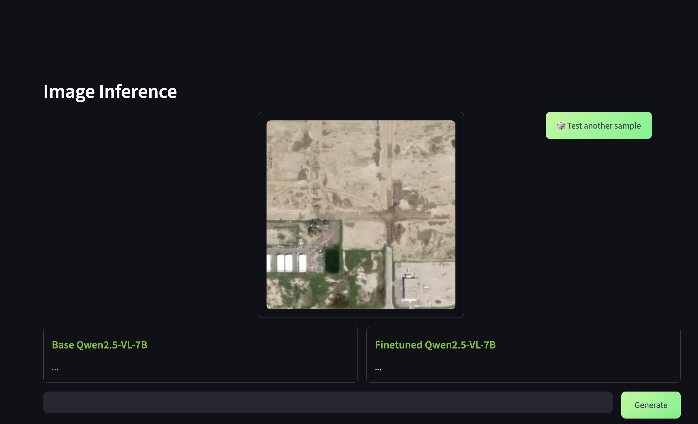
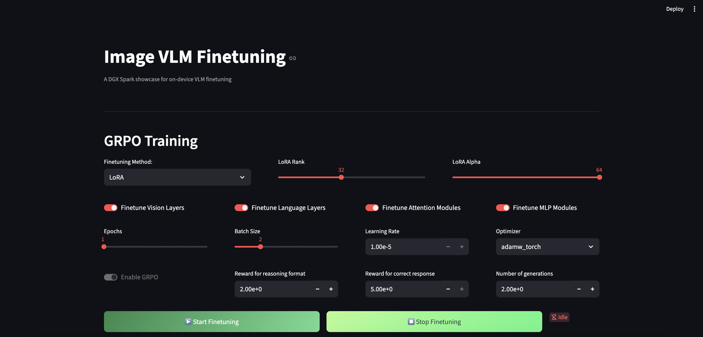

# Image VLM Fine-tuning with Qwen2.5-VL

This project demonstrates fine-tuning Vision-Language Models (VLMs) for image understanding tasks, specifically using the Qwen2.5-VL-7B model for wildfire detection from satellite imagery using GRPO (Generalized Reward Preference Optimization).

## Overview

The project includes:
- **Interactive Training Interface**: Streamlit-based UI for configuring and monitoring VLM fine-tuning
- **GRPO Training**: Advanced preference optimization for better reasoning capabilities
- **Multiple Fine-tuning Methods**: Support for LoRA and Full Finetuning
- **Side-by-side Inference using vLLM**: Run the base model and fine-tuned model side-by-side to compare performance

## Contents
1. [Model Download](#1-model-download)
2. [Dataset Preparation](#2-dataset-preparation)
3. [Base Model Inference](#3-base-model-inference)
4. [GRPO Finetuning](#4-grpo-finetuning)
5. [Finetuned Model Inference](#5-finetuned-model-inference)

## 1. Model Download

> **Note**: These instructions assume you are already inside the Docker container. For container setup, refer to the main project README at `vlm-finetuning/assets/README.md`.

### 1.1 Download the pre-trained model

```bash
hf download Qwen/Qwen2.5-VL-7B-Instruct
```

### 1.2 (Optional) Download the fine-tuned model

If you already have a fine-tuned checkpoint, place it in the `saved_model/` folder. 

# TODO: SHOW TREE AND SKIP TO INFERENCE

If you already have a finetuned checkpoint that you would like to just use for a comparative analysis against the base model, skip directly to the [Finetuned Model Inference](#5-finetuned-model-inference) section.

## 2. Dataset Preparation

The project uses a **Wildfire Detection Dataset** with satellite imagery for training the model to identify wildfire-affected regions. The dataset includes:
- Satellite and aerial imagery from wildfire-affected areas
- Binary classification: wildfire vs no wildfire

### 2.1 Create a dataset folder

```bash
mkdir -p ui_image/data
cd ui_image/data
```

### 2.2 Dataset Download

For this finetuning playbook, we will use the [Wildfire Prediction Dataset](https://www.kaggle.com/datasets/abdelghaniaaba/wildfire-prediction-dataset) from Kaggle. Visit the kaggle dataset page [here](https://www.kaggle.com/datasets/abdelghaniaaba/wildfire-prediction-dataset) to click the download button. Select the `cURL` option in the `Download Via` dropdown and copy the curl command. 

> **Note**: You will need to be logged into Kaggle and may need to accept the dataset terms before the download link works.

Run the following commands in your container:

```bash
# Past and run the curl command from Kaggle here, and then continue to unzip the dataset

unzip -qq wildfire-prediction-dataset.zip
rm wildfire-prediction-dataset.zip
cd ..
```

## 3. Base Model Inference

Before we start finetuning, let's start spin up the demo UI to evaluate the base model's performance on this task.

### 3.1 Spin up the Streamlit demo

```bash
streamlit run Image_VLM.py
```

Access the streamlit demo at http://localhost:8501/.

### 3.2 Wait for demo spin-up

When you access the streamlit demo for the first time, the backend triggers vLLM servers to spin up for the base model. You will see a spinner on the demo site as vLLM is being brought up for optimized inference. This step can take upto 15 mins.

After the streamlit demo is fully loaded, you should be able to see a similar UI state that is ready for inference.

<figure>
  
  <figcaption>Inference demo on the UI</figcaption>
</figure>

### 3.3 Run base model inference

Since we are currently focused on inferring the base model, let's scroll down to the `Image Inference` section of the UI. Here, you should see a sample pre-loaded satellite image of a potentially wildfire-affected region.

Enter your prompt in the chat box and hit `Generate`. Your prompt would be first sent to the base model and you should see the generation response on the left chat box. If you did not provide a finetuned model, you should not see any generations from the right chat box.

As you can see, the base model is incapable of providing the right response for this domain-specific task. Let's try to improve the model's accuracy by performing GRPO finetuning.

## 4. GRPO Finetuning

We will perform GRPO finetuning to add reasoning capabilities to our base model and improve the model's understanding to the underlying domain. Considering that you have already spun up the streamlit demo, scroll to the `GRPO Training section`.

<figure>
  
  <figcaption>Training parameters on the UI</figcaption>
</figure>

### 4.1 Model Settings

Configure the finetuning method and lora parameters based on the following options.

- `Finetuning Method`: Choose from Full Finetuning or LoRA
- `LoRA Parameters`: Adjustable rank (8-64) and alpha (8-64)

### 4.1 Finetune layers

You can additionally choose whether the layers you want to finetune in the VLM. For the best performance, ensure that all options are toggled on. Note that this will increase the model training time as well.

### 4.2 Training parameters

In this section, we can select certain model parameters as relevant to our training run.

- `Epochs`: 1-100
- `Batch Size`: 1, 2, 4, 8, or 16
- `Learning Rate`: 1e-6 to 1e-2
- `Optimizer`: AdamW or Adafactor

### 4.3 GRPO settings

For a GRPO setup, we also have the flexibility in choosing the reward that is assigned to the model based on certain criteria

- `Format Reward`: 2.0 (reward for proper reasoning format)
- `Correctness Reward`: 5.0 (reward for correct answers)
- `Number of Generations`: 4 (for preference optimization)

### 4.4 Start training

After configuring all the parameters, hit `Start Finetuning` to begin the training process. You will need to wait about 15 mins for the model to load and start recording metadata on the UI. As the training progresses, information such as the loss, epoch and GRPO rewards will be recorded on a live table.

### 4.5 Stop training

If you wish to stop training, just hit the `Stop Finetuning` button. Ensure that you stop the training with atleast 50 steps complete to ensure that a finetuned checkpoint is stored.

Once you stop training, the UI will automatically bring up the vLLM servers for the base model and the newly finetuned model.

## 5. Finetuned Model Inference

Now we are ready to perform a comparative analysis between the base model and the finetuned model. 

### 5.1 (Optional) Spin up the Streamlit demo

If you haven't spun up the streamlit demo already, execute the following command. If had just just stopped training and are still within the live UI, skip to the next step.

```bash
streamlit run Image_VLM.py
```

Access the streamlit demo at http://localhost:8501/.

### 5.2 vLLM startup

Regardless of whether you just spun up the demo or just stopped training, please wait about 15 mins for the vLLM servers to be brought up.

### 5.3 Run finetuned model inference

Scroll down to the `Image Inference` section, and enter your prompt in the provided chat box. Upon clicking `Generate`, your prompt would be first sent to the base model and then to the finetuned model. You can use the following prompt to quickly test inference

`Identify if this region has been affected by a wildfire`

If you trained your model sufficiently enough, you should see that the finetuned model is able to perform reasoning and provide a concise, accurate answer to the prompt. The reasoning steps are provided in the markdown format, while the final answer is bolded and provided at the end of the model's response.

For the image shown below, we have trained the model for 1000 steps, which took about 4 hours. 

### 5.4 Further analysis

If you wish to play around with these models with additional images, the `Test another sample` button will load another random satellite image. 

## File Structure

```
ui_image/
├── Image_VLM_Finetuning.py      # Main Streamlit application
├── README.md                    # This file
├── src/
│   ├── image_vlm_config.yaml    # Configuration file (update finetuned_model_id after training)
│   └── styles.css               # Custom UI styling
├── assets/
│   └── image_vlm/
│       └── images/
│           ├── wildfire/        # Wildfire-affected images
│           └── nowildfire/      # Non-wildfire images
├── assets/
│   └── inference_screenshot.png # UI demonstration screenshot
└── saved_model/                 # Training checkpoints directory (update config to point here)
```
