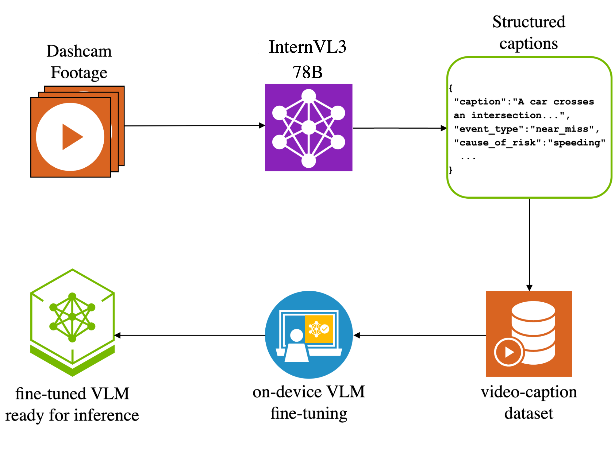
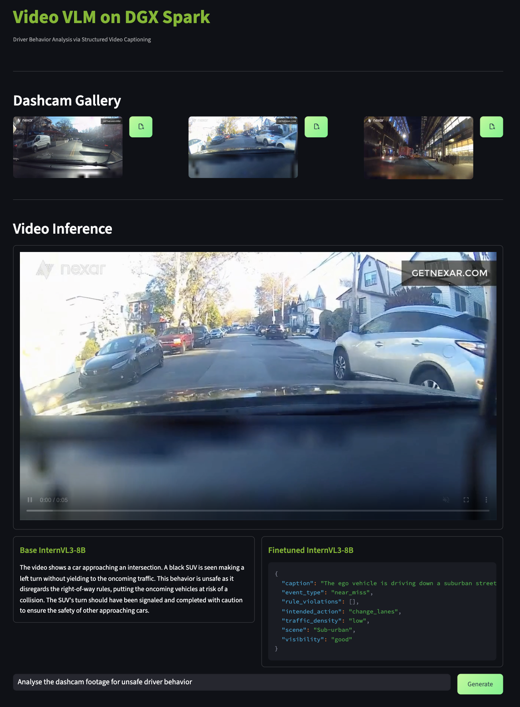
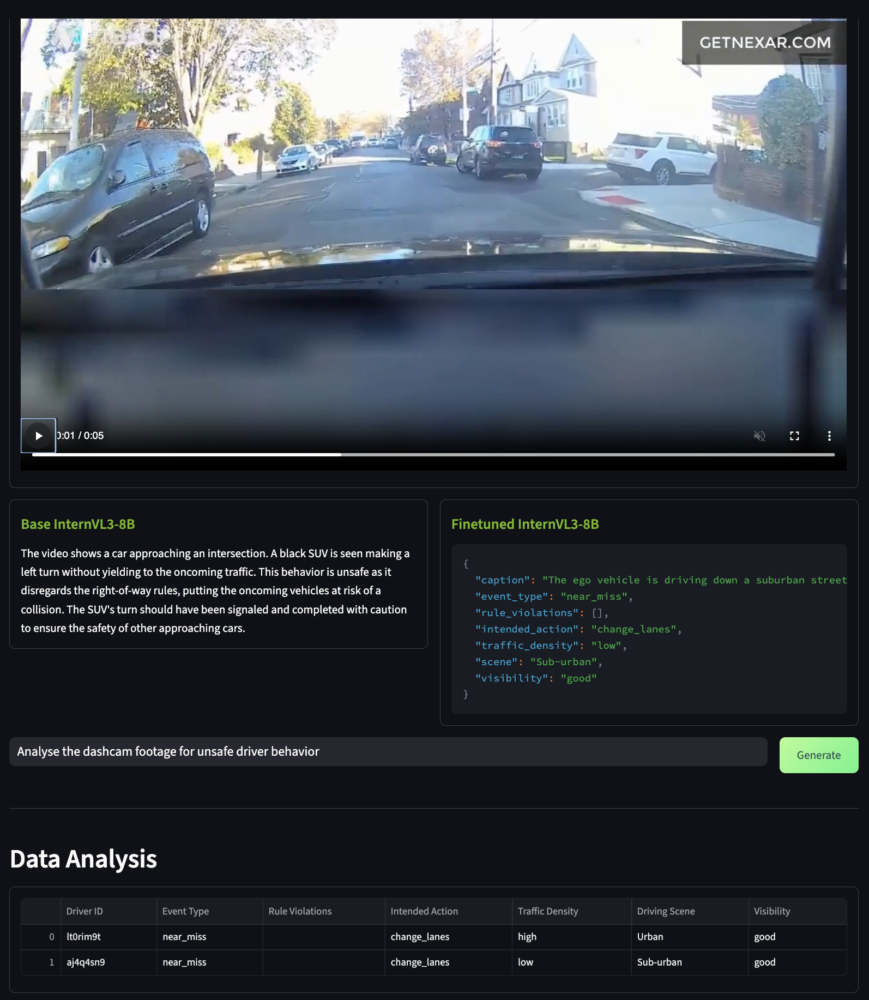

# Video VLM Fine-tuning with InternVL3

This project builds on top of the image VLM fine-tuning recipe to extend to the video modality. The notebook demonstrates how to fine-tuning the InternVL3 model for domain specific video analysis. For this prototype example, we have used driving dashcam footage from the [Nexar Scap Dataset](nexar-ai/nexar_collision_prediction) dataset to generate structured data which will be used for fine-tuning. 

## Workflow Overview

<figure>
  
  <figcaption>Video VLM fine-tuning Workflow Overview</figcaption>
</figure>

A typical workflow for a video fine-tuning includes the following:
1. **Data Collection**: Collect raw footage/videos for a domain specific task. If the videos are very long, chunck them into reasonable sized files, for instance 5 sec duration. 
2. **Generate Structured caption**: Collect structured caption for each video either using human generate dlabels or a larger VLM. 
3. **Train InternVL3 Model**: Perform Supervised Finetuning on InternVL3-8B to extract structured metadata
4. **Inference**: The fine-tuned model is noe ready for analysing domain specific videos. 

## Contents
1. [Dataset Preparation](#2-dataset-preparation)
2. [Model Download](#2-model-download)
3. [Base Model Inference](#3-base-model-inference)
4. [SFT Finetuning](#4-sft-finetuning)
5. [Finetuned Model Inference](#5-finetuned-model-inference)

## 1. Dataset Preparation

### 1.1 Data Source
Identify a video data source which would benefit from structured data analysis. The videos can be either live footage or shorter video clips. In our case, we have chosen the [Nexar Scap Dataset](nexar-ai/nexar_collision_prediction). 

### 1.2 Caption Schema
Based on the structured metedata that you would like to analyze from your video dataset, come up with a caption schema that can concisely capture your requirements. In our case, we have used the following schema. 

```json
{
    "video": "videos/video1.mp4",
    "caption": "Description of the video events",
    "event_type": "collision" | "near_miss" | "no_incident",
    "rule_violations": choose relevant items from ["speeding", "failure_to_yield", "ignoring_traffic_signs"],
    "intended_driving_action": "turn_left" | "turn_right" | "change_lanes",
    "traffic_density": "low" | "high",
    "visibility": "good" | "bad"
}
```

### 1.3 Caption Generation
With the cpation schema decided, we must now generate groundtruth, structured caption for all our videos. This can be achieved either by leveraging a larger VLM for AI-assisted annotation or human labellers to manually caption. 

### 1.4 Dataset structure 

```
# Enter the correct directory
cd ui_video
```

Place all your videos in `dataset/videos`. Additionally, the captions should be placed inside the `metadata.jsonl`.

Your dataset should be structured as follows:
```
dataset/
├── videos/
│   ├── video1.mp4
│   ├── video2.mp4
│   └── ...
└── metadata.jsonl
```

Your `metadata.jsonl` should look like this.

```
{"video": ..., "caption": ..., "event_type": ...}
{"video": ..., "caption": ..., "event_type": ...}
{"video": ..., "caption": ..., "event_type": ...}
```

## 2. Model Download

> **Note**: These instructions assume you are already inside the Docker container. For container setup, refer to the main project README at `vlm-finetuning/assets/README.md`.

### 2.1 Download the pre-trained model

```bash
hf download OpenGVLab/InternVL3-8B
```

### 2.2 (Optional) Download the fine-tuned model

If you already have a fine-tuned checkpoint, place it in the `saved_model/` folder. Your directory structure should look something like this. Note that your checkpoint number can be different.

```
saved_model/
└── checkpoint-3/
    ├── config.json
    ├── generation_config.json
    ├── model.safetensors.index.json
    ├── model-00001-of-00004.safetensors
    ├── model-00002-of-00004.safetensors
    ├── model-00003-of-00004.safetensors
    ├── model-00004-of-00004.safetensors
    ├── preprocessor_config.json
    ├── special_tokens_map.json
    ├── tokenizer_config.json
    ├── tokenizer.json
    ├── merges.txt
    └── vocab.json
```

If you already have a finetuned checkpoint that you would like to just use for a comparative analysis against the base model, skip directly to the [Finetuned Model Inference](#5-finetuned-model-inference) section.

## 3. Base Model Inference

Before going ahead to finetune our video VLM for this task, let's see how the base InternVL3-8B does.

### 3.1 Spin up the Streamlit demo

```bash
# cd into vlm_finetuning/assets/ui_video if you haven't already
streamlit run Video_VLM.py
```

Access the streamlit demo at http://localhost:8501/.

### 3.2 Wait for demo spin-up

When you access the streamlit demo for the first time, the backend triggers Huggingface to spin up the base model. You will see a spinner on the demo site as the model is being loaded, which can take upto 10 mins.

### 3.3 Run base model inference

First, let's select a video from our dashcam gallery. Upon clicking the green file open icon near a video, you should see the video render and play automatically for our reference.

Scroll down, enter your prompt in the chat box and hit `Generate`. Your prompt would be first sent to the base model and you should see the generation response on the left chat box. If you did not provide a finetuned model, you should not see any generations from the right chat box.

<figure>
  
  <figcaption>Base model inference on the UI</figcaption>
</figure>

As you can see, the base model is incapable of identifying the right events for this domain-specific task. Even if the base model can sometimes identify these events, it still only converts one form of unstructured data to another format of unstructured data. We cannot conduct reasonable data analytics for insights on large-scale video footage. Let's try to improve the model's accuracy and structured caption ability by performing SFT training.

If you are proceeding to train a finetuned model, ensure that the streamlit demo UI is brought down before proceeding to train. You can bring it by interrupting the terminal with `Ctrl+C` keystroke.

> **Note**: To clear out any extra occupied memory from your system, execute the following command outside the container after interrupting the ComfyUI server.
```bash
sudo sh -c 'sync; echo 3 > /proc/sys/vm/drop_caches'
```

## 4. SFT Finetuning

We will perform SFT finetuning to improve the quality of the base model and generate schema-adhering structured output.

### 4.1 Load the jupyter notebook

```bash
# Inside the container, navigate to the training directory
cd train
jupyter notebook video_vlm.ipynb
```

### 4.2 Train the model 

Follow the instructions in the jupyter notebook to perform SFT finetuning on a video VLM. Ensure that you set the path to your dataset correctly in the appropriate cell.

```python
dataset_path = "/path/to/your/dataset"
```

### 4.3 Training Configuration

Here are some of the key training parameters that are configurable. Please note that for reasonable quality, you will need to train your video VLM for atleast 24 hours given the complexity of processing spatio-temporal video sequences.

- **Model**: InternVL3-8B
- **Video Frames**: 12 to 16 frames per video
- **Sampling Mode**: Uniform temporal sampling
- **LoRA Configuration**: Efficient parameter updates for large-scale fine-tuning
- **Hyperparameters**: Exhaustive suite of hyperparameters to tune for video VLM finetuning

### 4.4 Monitor Training

You can monitor and evaluate the training progress and metrics, as they will be continuously shown in the notebook.

### 4.5 Shutdown

After training, ensure that you shutdown the jupyter kernel in the notebook and kill the jupyter server in the terminal with a `Ctrl+C` keystroke.

> **Note**: To clear out any extra occupied memory from your system, execute the following command outside the container after interrupting the ComfyUI server.
```bash
sudo sh -c 'sync; echo 3 > /proc/sys/vm/drop_caches'
```

## 5. Finetuned Model Inference

Now we are ready to perform a comparative analysis between the base model and the finetuned model. 

### 5.1 (Optional) Spin up the Streamlit demo

If you haven't spun up the streamlit demo already, execute the following command. If had just just stopped training and are still within the live UI, skip to the next step.

```bash
streamlit run Video_VLM.py
```

Access the streamlit demo at http://localhost:8501/.

### 5.2 Wait for demo spin-up

When you access the streamlit demo for the first time, the backend triggers Huggingface to spin up the base model. You will see a spinner on the demo site as the model is being loaded, which can take upto 10 mins.

### 5.3 Run finetuned model inference

Scroll down to the `Video Inference` section, and enter your prompt in the provided chat box. Upon clicking `Generate`, your prompt would be first sent to the base model and then to the finetuned model. You can use the following prompt to quickly test inference

`Analyze the dashcam footage for unsafe driver behavior`

If you trained your model sufficiently enough, you should see that the finetuned model is able to identify the salient events from the video and generate a structured output. 

### 5.4 Further analysis

Since the model's output adheres to the schema we trained, we can directly export the model's prediction into a database for video analytics. For the image shown below, we have trained the model for over 24 hours.

<figure>
  
  <figcaption>Finetuned model inference on the UI</figcaption>
</figure>

Feel free to play around with additional videos available in the gallery. 

## File Structure

```
ui_video/
├── README.md                 # This file
├── Video_VLM.py             # Streamlit web interface for inference
├── src/
│   ├── styles.css           # CSS styling for Streamlit app
│   └── video_vlm_config.yaml # Model and inference configuration
├── train/
│   └── video_vlm.ipynb      # Jupyter notebook for model training
└── assets/
    └── video_vlm/
        ├── videos/          # Sample video files
        └── thumbnails/      # Video thumbnail previews

# Root directory also contains:
├── Dockerfile               # Multi-stage Docker build with FFmpeg/Decord
└── launch.sh               # Docker launch script
```
               # Training checkpoints directory (update config to point here)
```

## Troubleshooting

If you are facing VRAM issues where the model fails to load or offloads to cpu/meta device, ensure you bring down all docker containers and flush out dangling memory.

```bash
docker ps

docker rm <CONTAINER_ID_1>
docker rm <CONTAINER_ID_2>

docker system prune

sudo sh -c 'sync; echo 3 > /proc/sys/vm/drop_caches'
```
